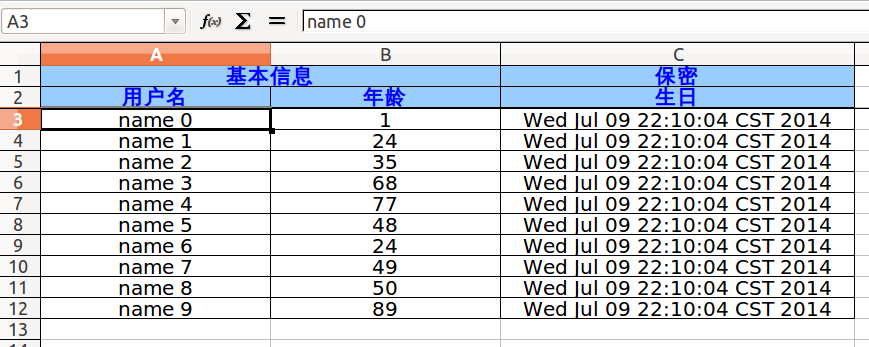

Simple-Excel - A simple excel builder
-------------------------------------

### Depencies
```xml
<!--excel报表下载的封装-->
<dependency>
    <groupId>net.sourceforge.jexcelapi</groupId>
    <artifactId>jxl</artifactId>
    <version>2.6.12</version>
</dependency>

<!--单元测试-->
<dependency>
    <groupId>junit</groupId>
    <artifactId>junit</artifactId>
    <version>4.8.1</version>
    <scope>test</scope>
</dependency>
```

### Usage

DataBean.java
```java
public class DataBean {
    String username;
    Integer age;
    Date birthday;

    public DataBean(String username, Integer age, Date birthday) {
        this.username = username;
        this.age = age;
        this.birthday = birthday;
    }

    public String getUsername() {
        return username;
    }

    public void setUsername(String username) {
        this.username = username;
    }

    public Integer getAge() {
        return age;
    }

    public void setAge(Integer age) {
        this.age = age;
    }

    public Date getBirthday() {
        return birthday;
    }

    public void setBirthday(Date birthday) {
        this.birthday = birthday;
    }
}
```
TestExcelFile.java
```java
public class TestExcelFile {

    List<DataBean> dataBeans;
    String[] titles = "基本信息,保密".split(",");
    int[] titleColSpans = {2, 1};
    String[] subTitles = "用户名,年龄,生日".split(",");

    @Before
    public void setUp() {
        dataBeans = new ArrayList<DataBean>();
        Random random = new Random();

        for (int i = 0; i < 10; i++) {
            dataBeans.add(new DataBean("name " + i, random.nextInt(100), new Date()));
        }
    }

    @Test
    public void generate() throws Exception {
        File file =
                new ExcelFile("测试文件生成")
                        .writeHead(titles, titleColSpans)
                        .writeHead(subTitles)
                        .writeRows(dataBeans, new RowReader<DataBean>() {
                            @Override
                            public List<Object> read(DataBean dataBean) {
                                List<Object> row = new ArrayList<Object>();
                                row.add(dataBean.getUsername());
                                row.add(dataBean.getAge());
                                row.add(dataBean.getBirthday());
                                return row;
                            }
                        }).end();

        ExcelFile.write(file,new FileOutputStream("./"+file.getName()));

        //do something with the generated file here
    }

}
```

### Demo

